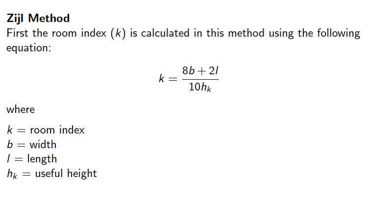

# Room Index Calculator

**Program Descreiption:** 
This Program calculates the room index value according to given room parameters.

**Program of Contents**
roomIndex.c

**Running the Codes** 
You can open and compile the roomIndex.c file with any c compiler.

**Using the Codes**
1. For example, go to the online c compiler using a search on the internet with a keyword which is online c compiler.

2. Copy the content of roomindex.c and paste it into the online editor.
3. Run the online compiler.
4. Enter the relevant desired parameters _**in centimeters**_. When you enter all the values, the result will appear on the screen.
   
5. To terminate the program, you must enter a number other than 1. If you want to do a calculation again, you can calculate a room index again by entering the number 1.

**Note** Formula is given below:
